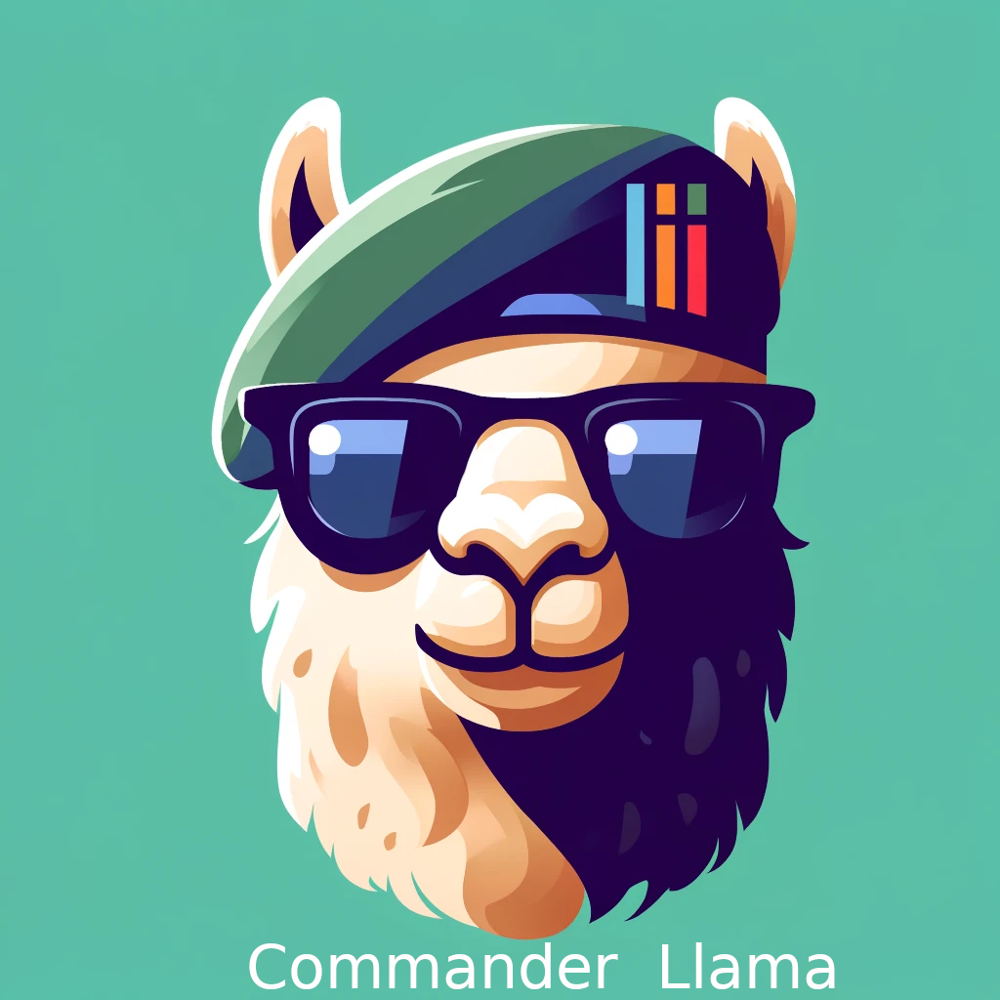

# Description
A command line AI assistant for Linux utilities

This tool is intended for use on a Linux system running Ollama with the lama3:8b model.  In addition to installing Ollama and downloading the lama3:8b model, you will need to install the ollama python library.

Sometimes you need help putting together a Linux command line to accomplish something.  Of course you can just Google it, or you could type a question into an AI web page, but since you are already staring at a terminal trying to think of the command, wouldn't it be more convenient to just type out what you need the command to do and get an answer right there?
This utility will attempt to do that, but be advised that the answers come from an LLM, and therefore you are responsible for verifying the commands before executing them.  The answers are merely tokens predicted by an LLM and they may be what you need, or if you are not careful, running the command could do harm to your data or your system.  The cmdr_llama.py script only prints the command and does not execute it.  It is up to you to decide whether to run the command that is printed and I am not responsible for the consequences of that decision. 
YOU HAVE BEEN WARNED.

In my case, this more often than not, just reminds me how to do something I already knew and forgot.  If I don't immediately recognize the command, I do a web search to verify exactly what it does.

For example:
```bash
$ cmdr_llama get the creation time of a file
stat -c "%Y" /path/to/file

$ cmdr_llama get date in epoch seconds
date +%s

$ cmdr_llama subtract one number from another
`bc -l <<< "10-4"`
```

## Installation Requirements
This is a simple script consisting mainly of a prompt template and an API call to a local Ollama server.
If you are okay with spending money and don't mind sending your prompt to someone else's server, then by all means modify the API call in the script (e.g. https://platform.openai.com/docs/quickstart).
As written, the script requires the ollama python library and makes an API call to llama3:8b on a local ollama server.
You will need to install Ollama (https://ollama.com) and download llama3:8b (or another model of your choosing)
```bash
$ ollama pull llama3:8b
```
and you will need to install the ollama python library:
```bash
$ pip install ollama
```
Edit the first line of the script (the shebang line) to point to whatever python environment you've installed the ollama library in.
Make the script executable and create a symbolic link to it in your path
```bash
chmod +x ~/commander-llama/cmdr_llama.py
sudo ln -s ~/commander-llama/cmdr_llama.py /usr/local/bin/cmdr_llama
```
